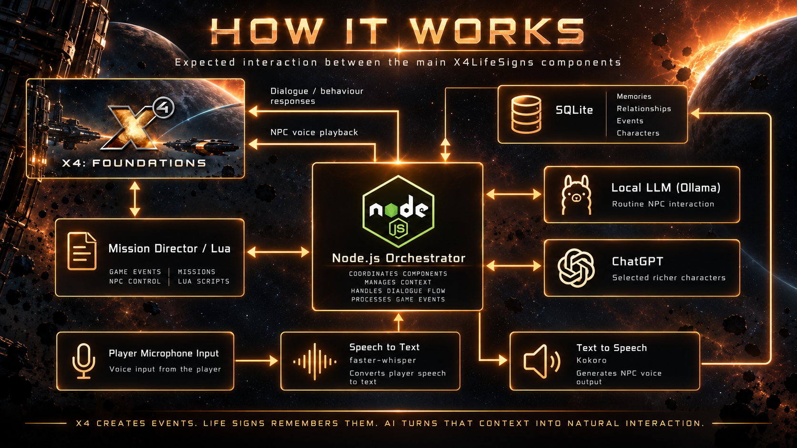

# X4: LIFE SIGNS

### Make the universe remember you.

 

**An experimental X4: Foundations mod that gives the universe memory, personality, and a sense that its people actually live there.**

---

## What is Life Signs?

**X4LifeSigns** is an experimental mod project for **X4: Foundations** built around a simple idea:

> What if the people in X4 could actually remember what happened to them?

NPCs should not feel like temporary dialogue boxes attached to ships and stations.

A pilot you rescued could remember you.

A captain whose ship you saved might recognise you later.

A trader you repeatedly helped could gradually become familiar with you.

Crew members could remember where they served, what happened around them, and who they encountered.

Characters could talk about things that genuinely happened in your universe rather than selecting another isolated line from a dialogue table.

Life Signs aims to give the simulation something it has never really had:

**a memory of itself.**

---

## Conversations With Context

Life Signs aims to build histories around X4's people, ships and stations, so a character's response could reflect where they have served, who helped them and what they survived. Keeping track of who is who would allow those experiences to matter across future encounters.

Instead of another "Hello, pilot", you might eventually hear:

> "You again. Last time I saw you, half my hull was missing and you were dragging pirates off us."

The language model would express a history grounded in real game events, not invent one. Two players could meet very different versions of similar characters because those characters have lived different lives.

**X4 creates the history. Life Signs remembers it.**

---

## How It Works

The proposed wider system connects X4 game events to a local Node.js application, with SQLite keeping the history. Language models could then turn that context into natural responses.

Most interaction is intended to run locally, with voice allowing players and characters to speak naturally. **Aria** is being explored as a richer persistent character, potentially using ChatGPT for deeper conversations and a stronger individual personality.

  

The diagram shows the intended design. The working experiments are described below; the detailed technology choices and boundaries are in [ARCHITECTURE.md](ARCHITECTURE.md).

---

## Project Status

**Very early implementation, not currently a playable release.**

The experimental bridge captures completed dockings while the player is personally piloting and acknowledges them in Node.js. Optional SQLite storage preserves those events for readback after Node.js restarts. Both have passed live X4 verification, with X4 kept running during the persistence test.

**Automatic session separation is Verified live in X4 9.00 with Node.js v24.21.0**, under the approved practical local single-player `s1` session-key assumption. Opt-in `--auto-db` routes V2 dockings into owned per-session databases; the [owner-run production acceptance matrix](docs/AUTOMATIC_SESSION_ROUTING.md#live-verification-record) passed. This does not establish guaranteed key uniqueness or continuity across sessions. Manual `--db` still needs a fresh database after a game reload or for another save/universe. Permanent entity identity, AI, voice and return communication remain unverified.

See the [docking bridge experiment](docs/BRIDGE_EXPERIMENT.md), [persistence experiment](docs/PERSISTENCE_EXPERIMENT.md) and [testing criteria](TESTING.md) for instructions, evidence and limitations.

**Persistent entity identity is In Progress**, beginning with the disposable
[six-ship identity diagnostic](docs/SHIP_IDENTITY_DIAGNOSTIC.md). The optional
diagnostic is **Implemented, unverified pending live X4 testing**. It observes
retained references in disposable saves; it does not implement persistent entity
identity.

<table>
  <thead><tr><th>Milestone</th><th>Status</th></tr></thead>
  <tbody>
    <tr><td valign="middle">X4 docking bridge</td><td align="center" valign="middle"></td></tr>
    <tr><td valign="middle">SQLite persistence across Node.js restarts</td><td align="center" valign="middle"></td></tr>
    <tr><td valign="middle">Automatic session separation</td><td align="center" valign="middle"></td></tr>
    <tr><td valign="middle">Persistent entity identity</td><td align="center" valign="middle"></td></tr>
    <tr><td valign="middle">Return path to X4</td><td align="center" valign="middle"></td></tr>
    <tr><td valign="middle">Local LLM integration</td><td align="center" valign="middle"></td></tr>
    <tr><td valign="middle">Voice input and output</td><td align="center" valign="middle"></td></tr>
    <tr><td valign="middle">Aria</td><td align="center" valign="middle"></td></tr>
  </tbody>
</table>

---

## Project Structure

| Path | Purpose |
| --- | --- |
| [`extension/`](extension/) | X4 extension and Mission Director docking probe. |
| [`bridge/`](bridge/) | Node.js log reader, SQLite storage, readback command and automated tests. |
| [`scripts/`](scripts/) | Deployment helper for the experimental extension. |
| [`docs/`](docs/) | Experiment instructions, evidence and verification records. |
| [`assets/`](assets/) | README artwork and status badges. |
| [`ARCHITECTURE.md`](ARCHITECTURE.md) | System design and implementation boundaries. |
| [`DATABASE.md`](DATABASE.md) | Current SQLite schema and persistence limitations. |
| [`DECISIONS.md`](DECISIONS.md) | Recorded project and technical decisions. |
| [`SETUP.md`](SETUP.md) | Development setup and local configuration guidance. |
| [`TESTING.md`](TESTING.md) | Automated checks, live test requirements and verification status. |

---

## The Bigger Idea

X4LifeSigns is the first implementation of a broader idea called **Life Signs**.

If the approach works, the underlying concept does not have to belong exclusively to X4.

Different games could potentially receive their own implementations while sharing the same basic philosophy:

> **Let the game create events.  
> Let Life Signs remember them.  
> Let the characters talk about the lives they actually lived.**

---

## X4LifeSigns

**Because a living universe should remember what happened in it.**

---

**Part of the Life Signs project.**

[Visit the Life Signs hub](https://github.com/yeahmyusernameis32characterslong/LifeSigns#lifesigns-top)

